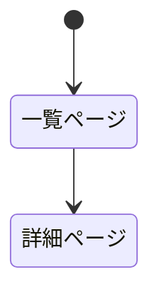

# webプログラミング　レポート　

##　1つ目のアプリ
### ・システムの対象

###　・ページ推移

```mermaid
stateDiagram-v2
    [*] --> 一覧ページ
    一覧ページ --> 詳細ページ
```

###　・スキーム

##　2つ目のアプリ
###　・システムの対象

###　・ページ推移
###　・スキーム

##　3つ目のアプリ
### ・システムの対象
###　・ページ推移
###　・スキーム
