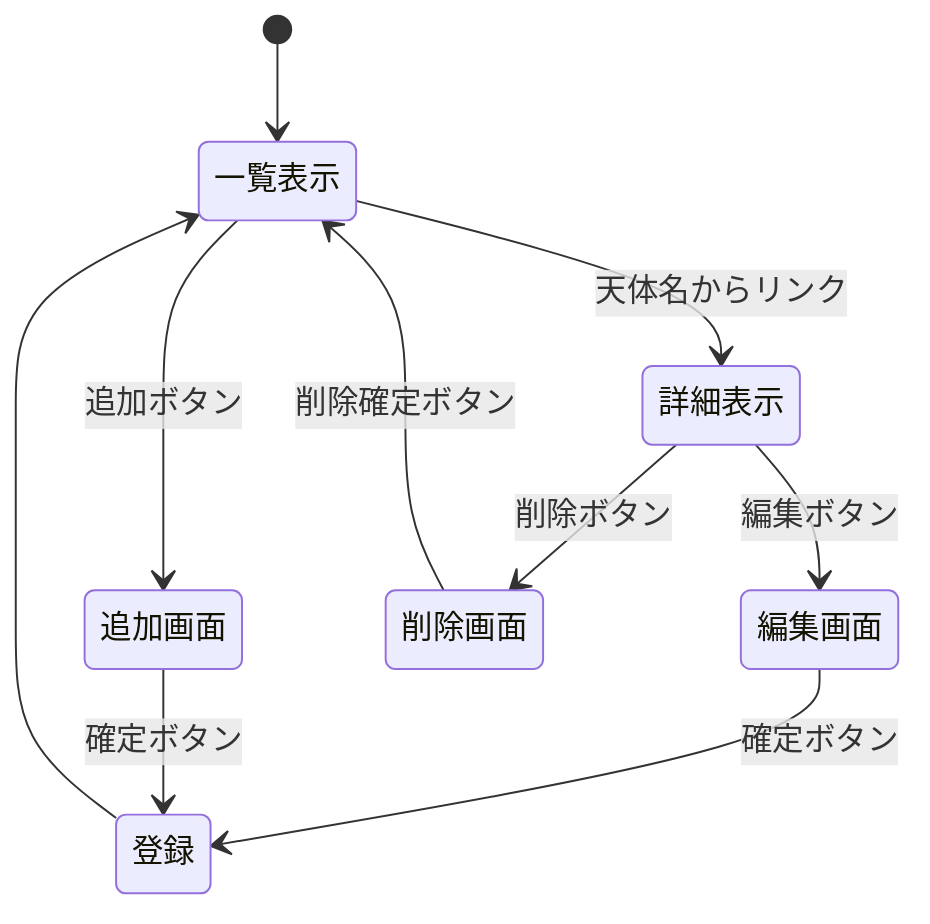

## 開発者用仕様書（仮）

とりあえず代表として，太陽系の天体システムについて書く

#### データ構造

任意の天体のデータが二次元配列で格納されている．ある一つの天体についての諸情報が格納された配列を，さらに複数の天体ごとに並べた配列の中に格納する．

↓初期状態で入れられているデータ↓
id | 天体名 | 天体の区分（惑星/小惑星 etc） | 直径（km） | 備考
-|-|-|-|-
0 | 太陽 | 恒星 | 1,392,700 | 直径は徐々に大きくなっている
1 | 水星 | 惑星 |  | 一旦放置
2 | 金星 | 惑星 |  | 
3 | 地球 | 惑星 |  | 
4 | 火星 | 惑星 |  | 
5 | 木星 | 惑星 |  | 
6 | 土星 | 惑星 |  | 
7 | 天王星 | 惑星 |  |
8 | 海王星 | 惑星 |  |
9 | 冥王星 | 準惑星 | |
10 |イトカワ|小惑星|0.535|探査機「はやぶさ」によって探査された．

#### ページ遷移

#### リソースごとの機能の詳細

##### \tentai_add
・データの追加
##### \tentai
・一覧表示
##### \tentai_detail
・詳細表示
##### \tentai_　delete 
・データの削除
##### \tentai_edit
・データの編集

