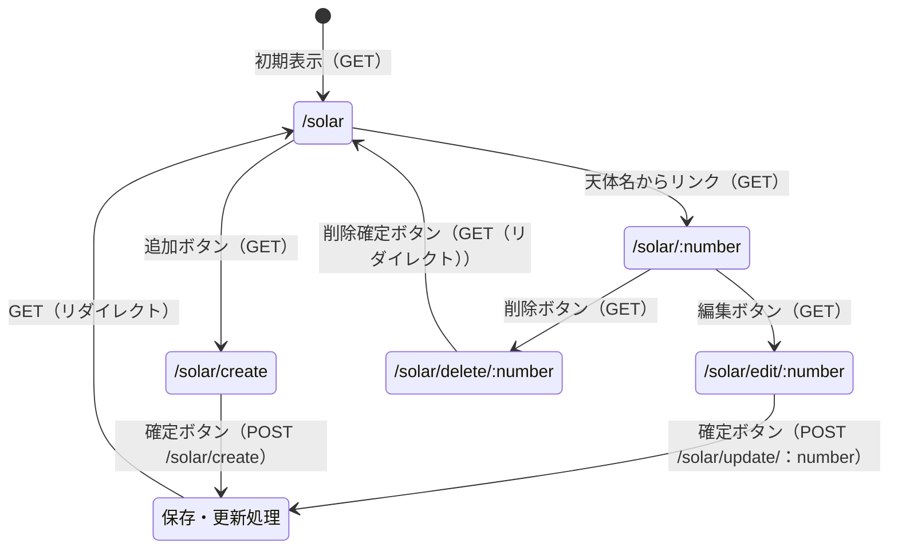
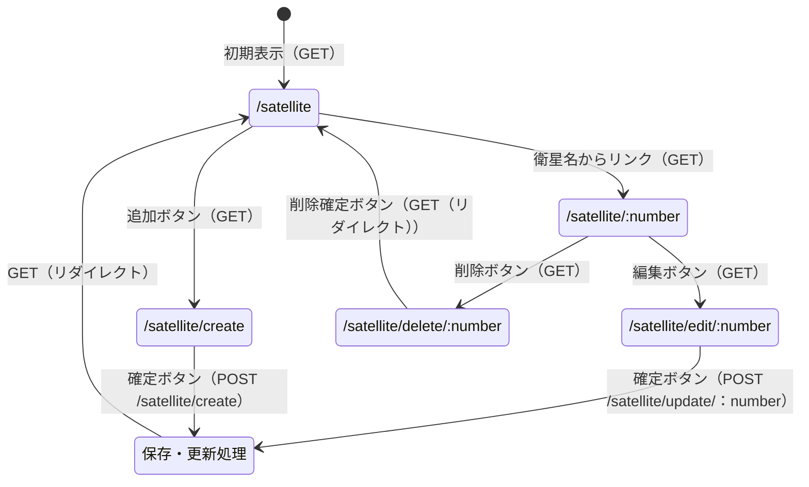
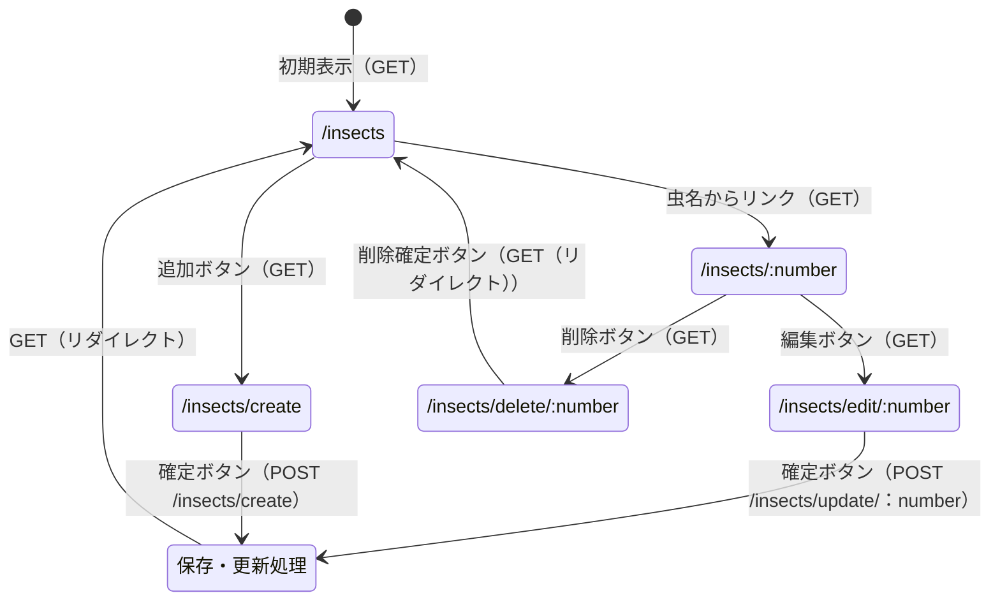

## 開発者用仕様書（仮）

とりあえず代表として，太陽系の天体システムについて書く

#### データ構造

任意の天体のデータが二次元配列で格納されている．ある一つの天体についての諸情報が格納された配列を，さらに複数の天体ごとに並べた配列の中に格納する．

↓初期状態で入れられているデータ↓

##### 太陽系の天体システムの初期データ
id | 天体名 | 天体の区分（惑星/小惑星 etc） | 直径（km） | 備考
-|-|-|-|-
0 | 太陽 | 恒星 | 1,392,700 | 直径は徐々に大きくなっている
1 | 水星 | 惑星 |  | 一旦放置
2 | 金星 | 惑星 |  | 
3 | 地球 | 惑星 |  | 
4 | 火星 | 惑星 |  | 
5 | 木星 | 惑星 |  | 
6 | 土星 | 惑星 |  | 
7 | 天王星 | 惑星 |  |
8 | 海王星 | 惑星 |  |
9 | 冥王星 | 準惑星 | |
10 |イトカワ|小惑星|0.535|探査機「はやぶさ」によって探査された．

##### 稼働中のJAXAの人工衛星システムの初期データ

id | 人工衛星名 | 打ち上げ日時 | 打ち上げ場所 | 備考
-|-|-|-|-
0 | れいめい | 2005年8月24日6時10分 | カザフスタン共和国 | 次世代の先進的な衛星技術の軌道上での実証や，小規模、高頻度の科学観測ミッションの実現を目的としている
1 | ひので | 2006年9月23日6時36分 | 内之浦宇宙空間観測所 | 太陽の観測を行っている
2 | はやぶさ2 | 2014年12月3日13時22分 | 種子島宇宙センター | 小惑星リュウグウを目標天体としている
3 | あらせ | 2016年12月20日（火）20時00分 | 内之浦宇宙空間観測所 | ヴァン・アレン帯に存在する高エネルギー電子の生成過程を直接観測するための探査衛星
4 | みお | 2018年10月20日10時45分 | フランス領ギアナ　クールー　ギアナ宇宙センター | 水星の磁場・磁気圏の解明を主な目的とする

##### 大学内で見た虫システムの初期データ

id | 和名 | 分類 | 発見場所 | 備考
-|-|-|-|-
0 | ハナアブ | ハエ目・ハナアブ科 | 新習志野キャンパス図書館前 | 空中で静止するように飛行するホバリングが可能．人や花に近づく．
1 | キマダラカメムシ | カメムシ目・カメムシ科 | 新習志野キャンパス3号館・11号館間の地面や木の幹 | 台湾から東南アジアを原産地とする外来生物である．
2 | クロオオアリ | ハチ目・アリ科・ヤマアリ亜科・オオアリ属 | 新習志野キャンパスおよび津田沼キャンパスのベンチ付近 | 開けた場所の乾燥した地面を好む．そのため都市部でも多く見られる．

#### ページ遷移

##### 太陽系の天体システムの遷移図

##### 稼働中のJAXAの人工衛星システムの遷移図

##### 大学内で見た虫システムの遷移図

#### リソースごとの機能の詳細（全然合ってないから無視してね）

##### \add
・データの追加
##### \
・一覧表示
##### \detail
・詳細表示
##### \delete 
・データの削除
##### \edit
・データの編集

